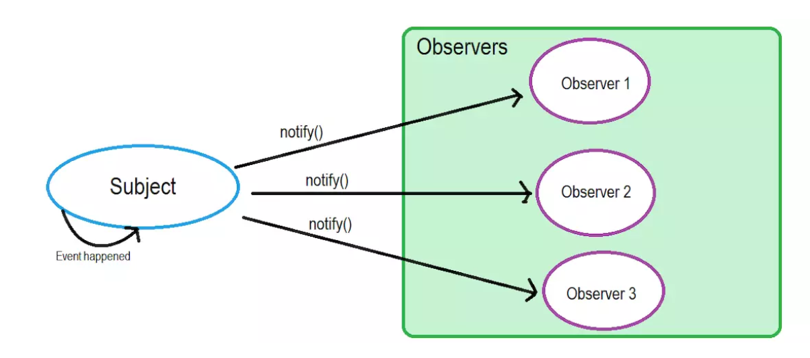

- 观察者模式 在软件设计中是一个对象，维护一个依赖列表，当任何状态发生改变自动通知它们。

我们假设你正在找一份软件工程师的工作，对“香蕉公司”很感兴趣。所以你联系了他们的HR，给了他你的联系电话。他保证如果有任何职位空缺都会通知你。这里还有几个候选人也你一样很感兴趣。所以职位空缺大家都会知道，如果你回应了他们的通知，他们就会联系你面试。

所以，以上和“观察者模式”有什么关系呢？这里的“香蕉公司”就是Subject，用来维护Observers（和你一样的候选人），为某些event（比如职位空缺）来通知（notify）观察者。

