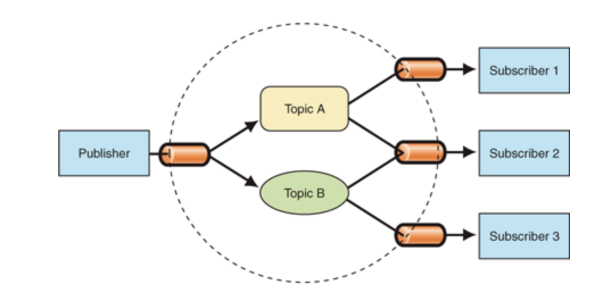
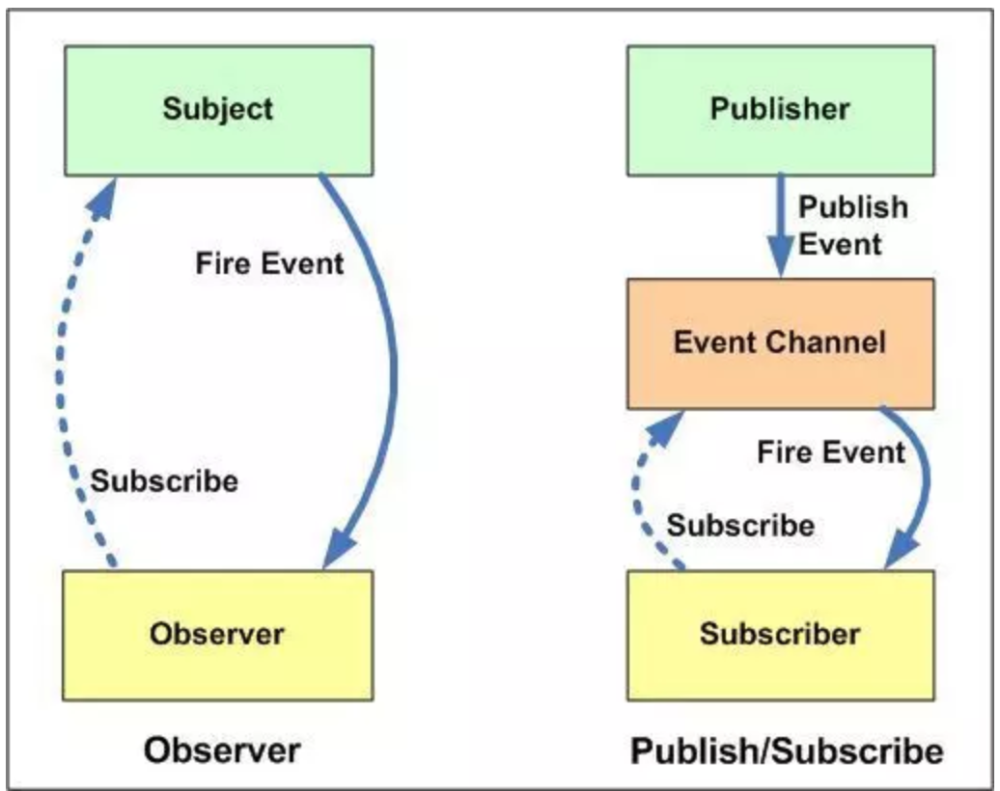

在观察者模式中的Subject就像一个发布者（Publisher）和观察者（Observer）完全和订阅者（Subscriber）关联。subject通知观察者就像一个发布者通知他的订阅者。这也就是很多书和文章使用“发布-订阅”概念来解释观察者设计模式。但是这里还有另外一个流行的模式叫做发布-订阅设计模式。它的概念和观察者模式非常类似。最大的区别是：

- 在发布-订阅模式，消息的发送方，叫做发布者（publishers），消息不会直接发送给特定的接收者，叫做订阅者。

意思就是发布者和订阅者不知道对方的存在。需要一个第三方组件，叫做信息中介，它将订阅者和发布者串联起来，它过滤和分配所有输入的消息。换句话说，发布-订阅模式用来处理不同系统组件的信息交流，即使这些组件不知道对方的存在。

所以，我用下图表示这两个模式最重要的区别

我们把这些差异快速总结一下：

- 在观察者模式中，观察者是知道Subject的，Subject一直保持对观察者进行记录。然而，在发布订阅模式中，发布者和订阅者不知道对方的存在。它们只有通过消息代理进行通信。

- 在发布订阅模式中，组件是松散耦合的，正好和观察者模式相反。

- 观察者模式大多数时候是同步的，比如当事件触发，Subject就会去调用观察者的方法。而发布-订阅模式大多数时候是异步的（使用消息队列）。

- 观察者 模式需要在单个应用程序地址空间中实现，而发布-订阅更像交叉应用模式。
